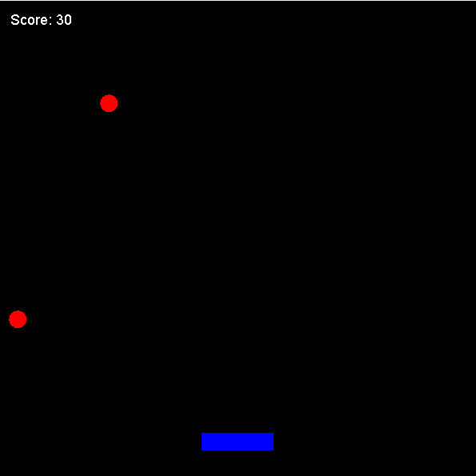

# 🎮 Catch the Square
**course code : SWE-06132124-Project**
> **A fast-paced arcade catching game built with Java Swing**

---


*Red circles fall. You catch them. Simple. Addictive.*

<div align="center">
  
</div>

---

## 📋 Table of Contents

- [Overview](#overview)
- [Gameplay](#gameplay)
- [Controls](#controls)
- [Scoring](#scoring)
- [Architecture](#architecture)
- [Getting Started](#getting-started)
- [Project Structure](#project-structure)

---

## Overview

**Catch the Square** is a minimalist arcade game where your reflexes are your only asset. Red collectibles fall from the top of a 400×400 black arena — your job is to slide a blue paddle left and right to intercept them before they hit the ground. Miss too many and the floor fills with regret. Catch them all and your score climbs endlessly.

| Attribute        | Detail                  |
|------------------|-------------------------|
| **Platform**     | Desktop (Java)          |
| **Language**     | Java 17+                |
| **UI Framework** | Java Swing              |
| **Window Size**  | 400 × 400 px            |
| **Game Loop**    | ~60 FPS (16ms timer)    |
| **Input**        | Keyboard (← →)          |

---

## Gameplay

```
┌─────────────────────────────────┐
│                                 │
│   ●      ●            ●         │  ← Red circles spawn randomly
│                                 │     at the top every ~1 second
│        ●       ●                │
│                                 │
│   ●                   ●         │
│                                 │
│              ●                  │
│                                 │
│   ▓▓▓▓▓▓▓▓▓▓▓▓                 │  ← Blue paddle (you)
└─────────────────────────────────┘
  Score: 0
```

- **Collectibles** (red circles, 15×15 px) rain down at a steady speed of **3 px/frame**
- A new collectible spawns every **60 ticks (~1 second)**
- Collectibles that reach the bottom simply disappear — no lives lost, but no points either
- The game runs **indefinitely** — push your high score as far as you can

---

## Controls

| Key         | Action               |
|-------------|----------------------|
| `←` Left Arrow  | Move paddle left  |
| `→` Right Arrow | Move paddle right |

> The paddle stops at the screen edges — no wrapping.

---

## Scoring

| Event              | Points |
|--------------------|--------|
| Catch a collectible | **+10** |
| Miss a collectible  | 0      |

Score is displayed live in the **top-left corner** of the game window. There is no upper limit — play until you decide to stop.

---

## Architecture

The project follows a clean **MVC-inspired layered design**:

```
src/
└── game/
    ├── main/          ← Entry point
    │   └── Main.java
    ├── model/         ← Game logic & entities
    │   ├── Entity.java       (abstract base)
    │   ├── Player.java       (paddle)
    │   └── Collectible.java  (falling circles)
    └── ui/            ← Rendering & game loop
        └── GamePanel.java
```

### Class Relationships

```
         ┌────────────┐
         │   Entity   │  (abstract)
         │────────────│
         │ x, y, w, h │
         │ getBounds()│
         │ update()   │
         │ draw()     │
         └─────┬──────┘
               │ extends
       ┌───────┴────────┐
       │                │
  ┌────┴─────┐   ┌──────┴──────┐
  │  Player  │   │ Collectible │
  │──────────│   │─────────────│
  │ speed: 5 │   │ velocityY:3 │
  │ ←/→ move │   │ falls down  │
  │ blue rect│   │ red circle  │
  └──────────┘   └─────────────┘
        │                │
        └───────┬─────────┘
                │ managed by
          ┌─────┴──────┐
          │ GamePanel  │
          │────────────│
          │ game loop  │
          │ collision  │
          │ scoring    │
          │ rendering  │
          └────────────┘
```

| Class | Responsibility |
|---|---|
| `Entity` | Abstract base — position, size, collision bounds |
| `Player` | Paddle movement, boundary clamping, keyboard response |
| `Collectible` | Downward fall, off-screen detection |
| `GamePanel` | Game loop (60 FPS), spawning, collision detection, score, rendering |
| `Main` | JFrame bootstrap, window config |

---

## Getting Started

### Prerequisites

- Java **17 or higher** installed
- `java` and `javac` available on your system `PATH`

### Quick Run (Windows)

```powershell
.\run.bat
```

### Manual Compile & Run

```powershell
# Compile
javac -d out (Get-ChildItem -Recurse src -Filter *.java | ForEach-Object { $_.FullName })

# Run
java -cp out game.main.Main
```

---

## Project Structure

```
SWE-06132124-Project/
├── Assets/Screenshot.png
├── src/
│   └── game/
│       ├── main/
│       │   └── Main.java
│       ├── model/
│       │   ├── Entity.java
│       │   ├── Player.java
│       │   └── Collectible.java
│       └── ui/
│           └── GamePanel.java
├── out/                  ← Compiled .class files (generated)
├── run.bat               ← One-click build & run script
├── .gitignore
└── README.md
```

---

## 👥 Built By

<div align="center">

| | Name | Registration No. |
|---|---|---|
| 👤 | **Joydip Majumdar Borno** | 2023831004 |
| 👤 | **Fahim Ahammad Tanvir** | 2023831018 |

</div>

---

<div align="center">

**Built with Java · Swing UI · SWE-06132124-Project**

*Catch every last one.*

</div>
